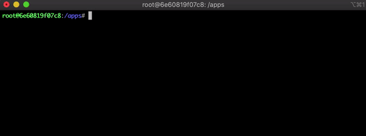

=====
Usage
=====

**Terminology**

poem

    Python project developed with Poetry

Poems Registry

    ``.poetry-poems`` file that stores paths to all poems available to poetry-poems. It is created in your ``$HOME`` directory.

Interactive Switcher
====================

Choose your poem from a prepopulated list with an interactive switcher. Adding poems to the Poem Registry is required, see: `Add a new poem`_.

.. code:: console

    $ poems

Choosing a poem will *cd* into the project directory and activate the corresponding Poetry Shell.

Add a new poem
==============

Before using Poems to activate a poem, its path has to be added to the Poems Registry:

.. code:: console

    $ poems --add <project_path>
    $ poems --add $PWD
    $ poems --add .

.. note::

    Virtual environments created with Poetry (`poetry shell`) by default are kept in `poetry config virtualenvs.path`. They do not store paths to projects (as you may use the same virtual environment in multiple projects). However, it is possible to get a link from the project to the corresponding Poetry virtual environment. Therefore, Poems takes advantage of a hidden file `.poetry-poems` that is created to store paths to Poetry projects.

.venv in project
----------------

In case you would like to activate a poem with a virtual environment located in the project directory (created by Poetry or with `virtualenv`), please make sure that Poetry is configured correctly in the project directory:

.. code:: console

    $ cd <project_path>
    $ poetry config --local virtualenvs.in-project true

Currently, virtual environments called ``.venv`` are supported.

.. note::

    This command is helpful to see the virtual environment associated with Poetry project:

    .. code:: console

        $ poetry env list --full-path

Keyboard Shortcuts
------------------

The Interactive environment switcher accepts the following commands:

* ``UP`` + ``DOWN``: Scroll through the list
* ``ENTER``: Select and activate the poem
* ``ESC``: Exit Poems
* ``LEFT`` + ``RIGHT``: See the detailed information about each poem
* ``QUERY``: Start writing a poem name to filter the list
* ``BACKSPACE``: Delete last character from filter term
* ``DEL``: Clear filter

Activate a poem from the Command Line
=====================================

Activate a project directly by writing poems followed by a poem name:

.. code:: console

    $ poems project1

If a query term (eg. ``proj``) matches more than one project,
the `Interactive Switcher`_ will launch with the list filtered by
the entered query term.

------------------------------------------------------

Other commands
==============

List Environments
-----------------

This command will list all poems saved in Poems Registry:

.. code:: console

    $ poems --list

Output:

.. code:: console

    BBreaker *
    MemoryMuppets *
    venv_by_virtualenv *
    venv_by_poetry *
    not_poetry_project *
    not_existent_project *

See more details about each poem:

.. code:: console

    $ poems --list --verbose

Output:

.. code:: console

    POETRY_HOME: /.cache/pypoetry/virtualenvs

    BBreaker *
        Environment:         ~.cache~pypoetry~virtualenvs~bbreaker-z2QUBx6S-py3.9
        Binary:              Python 3.9.1
        Project Dir:         ~apps~BBreaker

    MemoryMuppets *
        Environment:         ~.cache~pypoetry~virtualenvs~memorymuppets-HTGmVbtZ-py3.8
        Binary:              Python 3.8.7
        Project Dir:         ~apps~MemoryMuppets

    venv_by_virtualenv *
        Environment:         ~apps~venv_by_virtualenv~.venv
        Binary:              Python 3.8.7
        Project Dir:         ~apps~venv_by_virtualenv

    venv_by_poetry *
        Environment:         ~apps~venv_by_poetry~.venv
        Binary:              Python 3.7.9
        Project Dir:         ~apps~venv_by_poetry

    not_poetry_project *
        Environment:         -- Not configured --
        Binary:              -- Not configured --
        Project Dir:         ~apps~not_poetry_project

    not_existent_project *
        Environment:         -- Not configured --
        Binary:              -- Not configured --
        Project Dir:         ~apps~not_existent_project

Delete poem
-----------

This deletes only a path to the poem from the Poems Registry. The project and virtual environment remain untouched.

.. code:: console

    $ poems --delete not_poetry_project

Output:

.. code:: console

    Are you sure you want to delete: '/apps/not_poetry_project' from poems file? [y/N]: y
    Poem 'not_poetry_project' deleted from poems file

Custom Poems Registry
---------------------

It is possible to use custom Poems Registry file (in case you work on microservices belonging to one particular project):

.. code:: console

    $ poems --poems_file <custom_poems_file>

---------------------

Usage Help
----------

The list of available commands together with short descriptions can be accessed right in the command line:

.. code:: console

    $ poems --help
